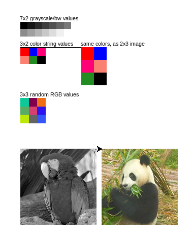

# Example of using renertpy.turtle module

Functions:

* `draw_image(pixel_data, width, resize_width=None)` - draws the pixel data as an image.
    `pixel_data` can be a list of integers (0-255) - for a grayscale image;
    or a list of strings for color names or hex values - for RGB image;
    or a list of (r,g,b) tuples - for RGB image.
* `get_data_bw(name)` - get one of the built-in photos as a list of integers.
* `get_data_rgb(name)` - get one of the built-in photos as a list of (r,g,b) values.
* available images: `balls, butterfly, kitten, llama, paints, panda, parrot, puppy, rose, sloth, tulips`.

## Code Example

```python
from turtle import *
from renertpy.turtle import *
colormode(255)

penup()
goto(-200, 130)
pendown()

# 14 gray-scale values (0=black, 255=white)
data_bw = [ 0,   20,  40,  60,  80,  100, 120,
            140, 160, 180, 200, 220, 240, 255 ]
# Draw them as 7x2 image, and scale up to 100 pixels width.
write("7x2 grayscale/bw values")
draw_image(data_bw, 7, resize_width=100)

penup()
goto(-200, 80)
pendown()

# 6 colors, as color names and hexcolors
data_colors = [ "red",    "blue",         "#FF0077",
                "salmon", "forest green", "#000"]
# Draw them as 3x2 image
write("3x2 color string values")
draw_image(data_colors, 3, resize_width=50)

forward(120)

# Draw them again, this time 2x3 image
write("same colors, as 2x3 image")
draw_image(data_colors, 2, resize_width=50)

penup()
goto(-200, -20)
pendown()

# 9 random colors
data_rgb = [
    (13, 201, 154), (128, 0, 78), (240, 111, 22),
    (88, 172, 99),  (215, 63, 110), (45, 19, 237),
    (189, 231, 7), (100, 100, 100), (52, 86, 250)
]
write("3x3 random RGB values")
draw_image(data_rgb, 3, resize_width=50)


penup()
goto(-200, -120)
pendown()

parrot_bw = get_data_bw("parrot")
draw_image(parrot_bw, 150)

forward(160)

panda_rgb = get_data_rgb("panda")
draw_image(panda_rgb, 150)
```

## Output Example



## Installation notes

On Linux/Chromebook, if you get an error message:

    `ImportError: cannot import name 'ImageTK'`

Try to install:

    `sudo apt-get install python3-pil python3-pil.imagetk`
